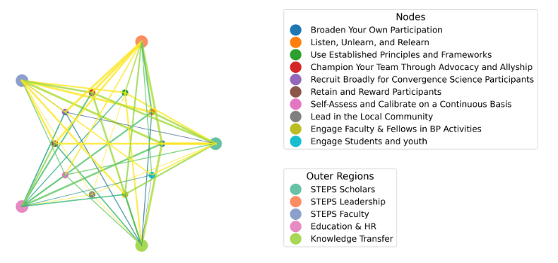

# 📚 STEM Practices Knowledge Graph
[](https://doi.org/10.5281/zenodo.YOUR_DOI_ID)


This Python script generates a customizable, publication-quality knowledge graph that visualizes the relationships between best practices used by STEM education centers.  
The graph highlights clusters, connection strengths, and labels, and exports two high-resolution images with and without text.



---


## ✨ Features

- Directed, weighted network graph using NetworkX
- Node coloring based on user-defined clusters
- Weighted edges with optional relationship labels
- Two export modes: with labels and without
- Saves layout for consistent re-use across sessions
- High-resolution PNG output ready for publication or presentation

---

## 🧠 How It Works

1. **Nodes** represent best practice themes.
2. **Edges** represent directional relationships and vary in thickness based on weight.
3. **Edge labels** (e.g., "supports", "drives") explain how one practice influences another.
4. **Clusters** are color-coded and used to group practices into broader categories.

---

## 🗂️ Files

- `stem_practices_knowledge_graph.py` — main Python script
- `layout_positions.pkl` — saved layout for consistent node positioning
- `knowledge_graph_with_text.png` — PNG output with full node/edge labels
- `knowledge_graph_no_labels.png` — clean PNG version without any text

---

## 🛠️ Requirements

- Python 3.7+
- Packages:
  - `networkx`
  - `matplotlib`
  - `pickle` (standard lib)
  - `os` (standard lib)

---

## 📸 Example Output

  
_Automatically generated PNG with color-coded nodes, directional arrows, and labeled relationships._

---

## 📜 License

This project is licensed under the MIT License.  
See the [LICENSE](LICENSE) file for full terms.

---

Install dependencies:

```bash
pip install networkx matplotlib
